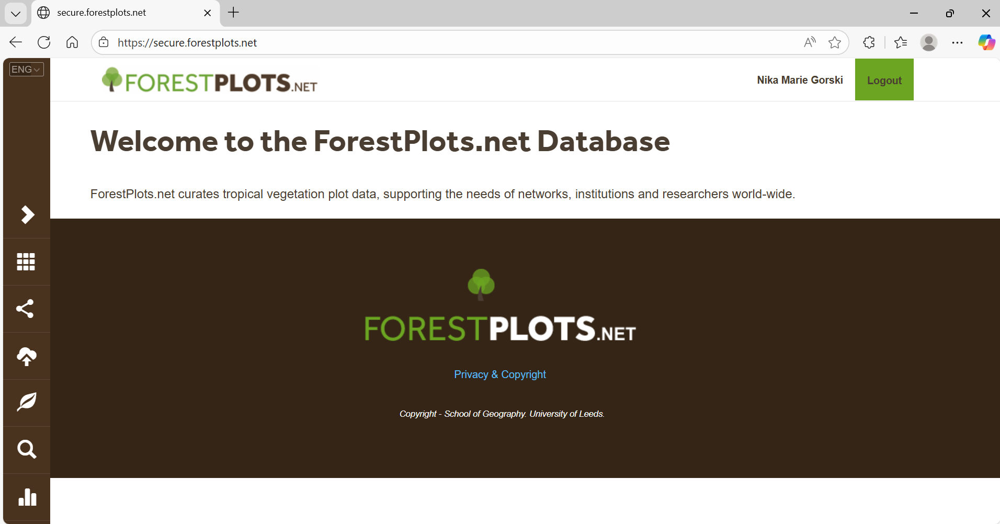

# (PART) One time set up {-}

# Accessing ForestPlots

When re-censusing a plot, you need access to the data from the previous censuses in order to make a field sheet, find the plot, and collect the data. You can find everything you need on [ForestPlots.net](ForestPlots.net).

&nbsp; 

## What is ForestPlots? {-}

[ForestPlots.net](ForestPlots.net) is a database where you can securely store, manage and analyse tropical forest plot data.

&nbsp;

[ForestPlots.net](ForestPlots.net) stores and serves stem data and metadata for multi- and single-census plots in forests and savannas, including trees, lianas, species, demography, traits and soils.

## How to access ForestPlots data?

In order to access the ForestPlots data, you must

1. Read the [code of conduct](https://forestplots.net/en/join-forestplots/code-of-conduct),   
2. Register to have an account on ForestPlots [here](https://forestplots.net/en/join-forestplots/user-gui), and    
3. Email the associated country data officer to ensure the account is granted and to receive the necessary training to use ForestPlots. *Note: Nika Gorski is the data officer for Africa data.*

Only once you have completed these steps will you be able to access data to ForestPlots and produce field sheets.

If you haven't fully completed these steps, you can still move on to `Module 3 and 4` to install the necessary software on your laptop and tablet.