# How to set up your laptop
Whether you have a ForestPlots account, you now need to set up your computer and your tablet.
Your will use your computer to create the surveys and your tablet to execute them.
While seemingly boring, the next steps are crucial: if executed properly, they will save us a tremendous amount of issues. Therefore, please take your time so we can stay organised from the beginning.

[QGIS](https://qgis.org/) is a geographic information system software. In order to install QGIS on your computer, please follow these steps:

**1.** Click [here](https://qgis.org/download/) to access the download package. If you feel generous, you can make a contribution to QGIS or skip to download (orange button *Skip it and go to download*).
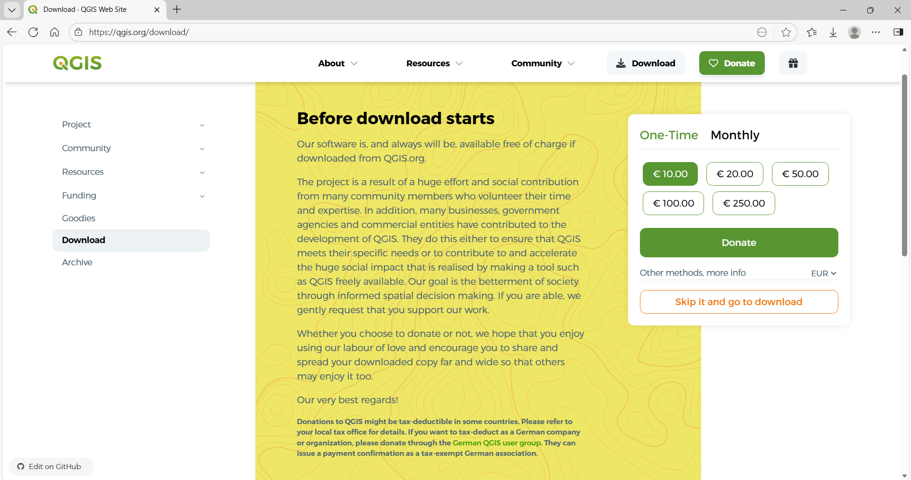

**2.** Once you passed the donation page, download the most recent **Long Term Release** (currently **Download LTR 3.40**). Do not download the *Latest release*, it is not needed for what we do and is more likely to come with bugs.
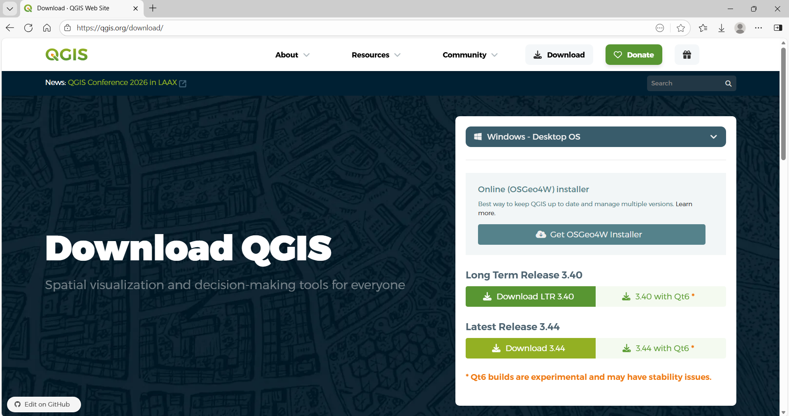

**3.** Once you have downloaded the QGIS installation file, open it and follow the instructions. We advise you to keep the default and recommended set-up options.

**4.** Congratulations, you have installed QGIS on your computer! You can now launch it (be patient, QGIS may take some time to launch) and should soon see a similar interface:
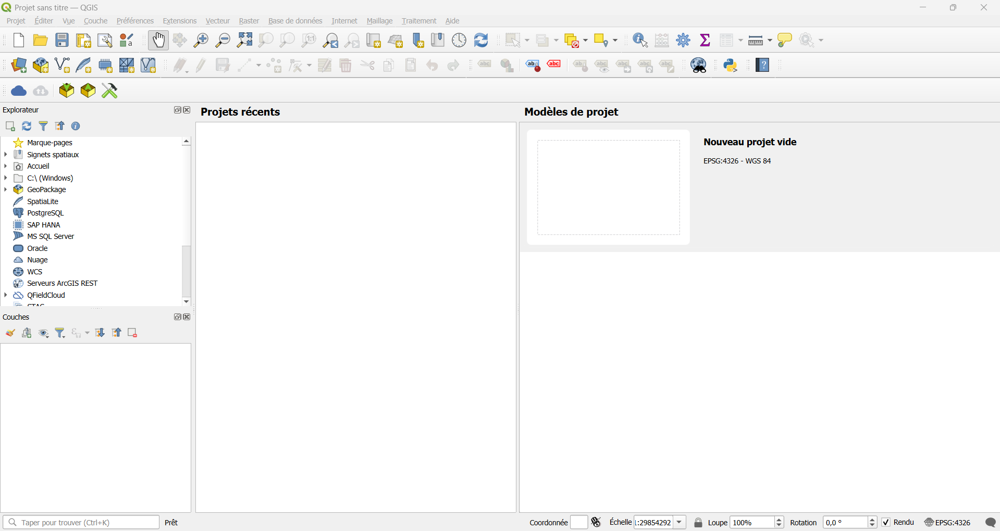

**5.** Click on the *Extensions* menu and select *Installer/Gérer les extensions*.
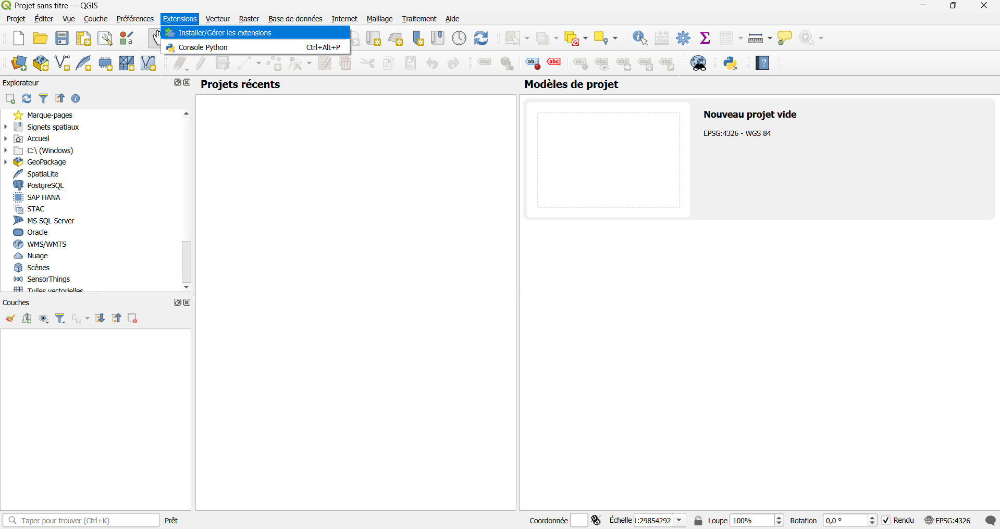

**6.** Type 'QField Sync' in the research bar of the pop-up window.
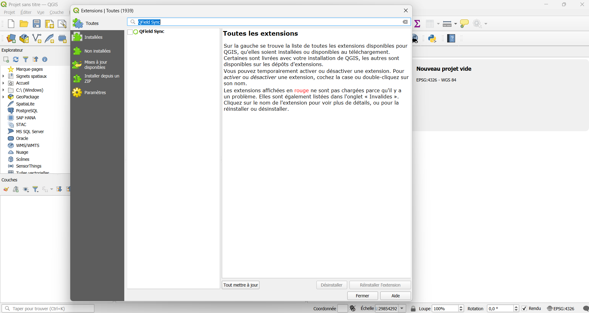

**7.** Tick the box near *QField Sync*, just below the research bar, and close the pop-up window.
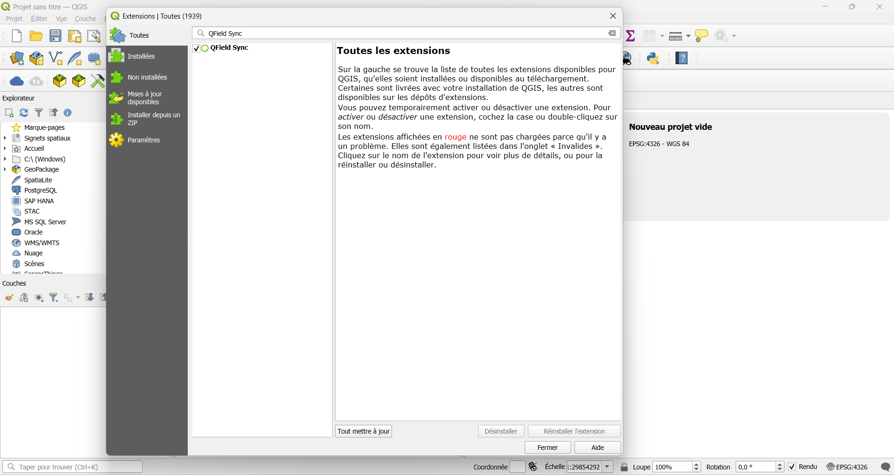

**8.** Click on the *Extensions* menu, a *QField Sync* sub-menu should now be present.
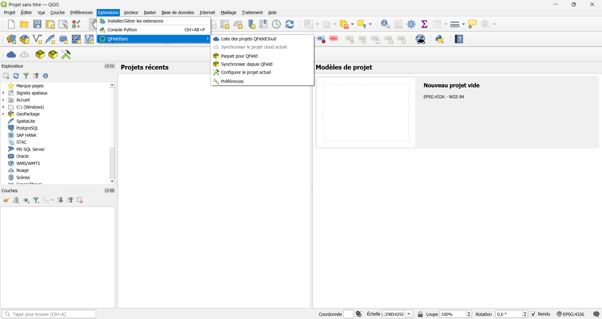

# How to set up your tablet
[QField](https://qfield.org/) is an open-access application for spatial data collection and edition. Here, we assume that you already set up your tablet with a Google account that grants you access to the Google Play Store. In order to install QField on your tablet, please follow these steps:

**1.** Go to the tablet homepage.
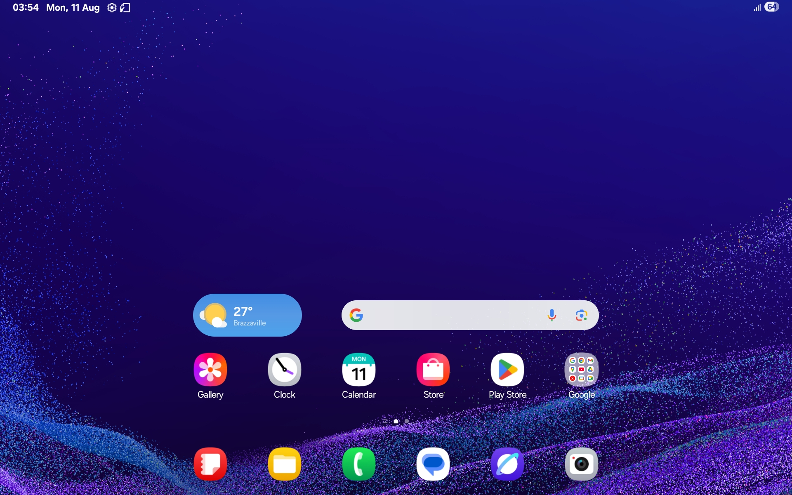

**2.** Open the Play Store.

&nbsp;

**3.** Click on the *Sign in* symbol.
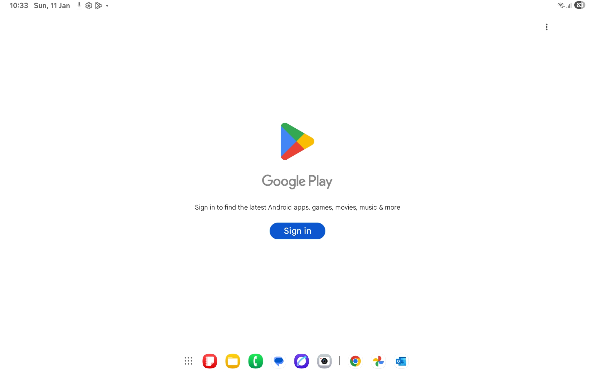

**4.** Either sign in with your own Google account (not recommended) or create an account with a clear name and address. For instance, you can paste the name of your project and country or institution. Choose a secured password that you are also able to remember. It is good to store it somewhere safe and share it with a couple of colleagues.
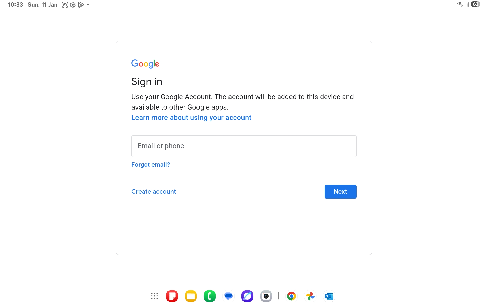

**5.** Welcome to the Play Store, you can click on *Not now*.
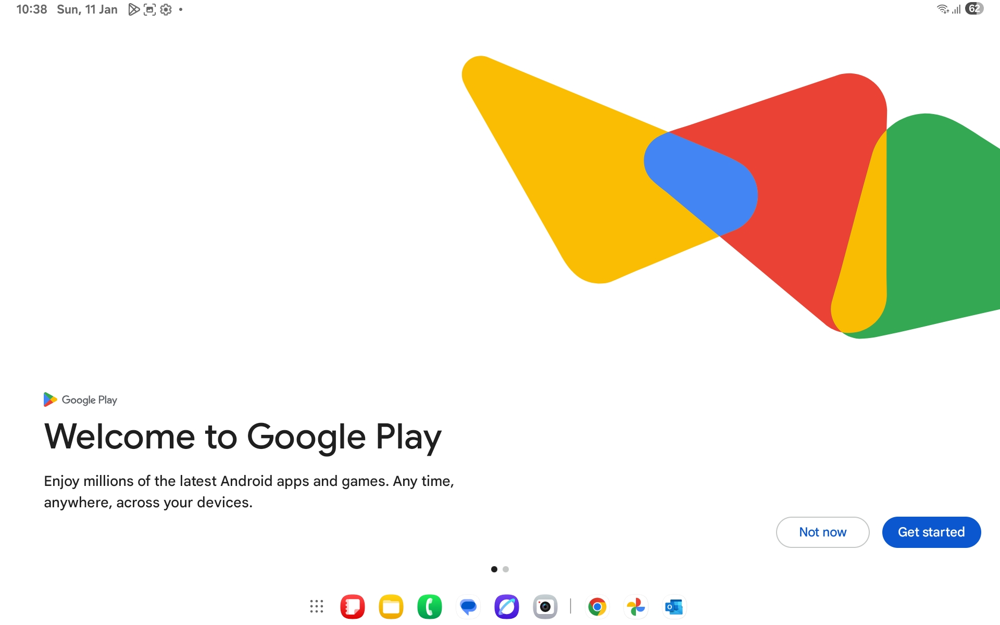

**6.** Type 'qfield' in the research bar.
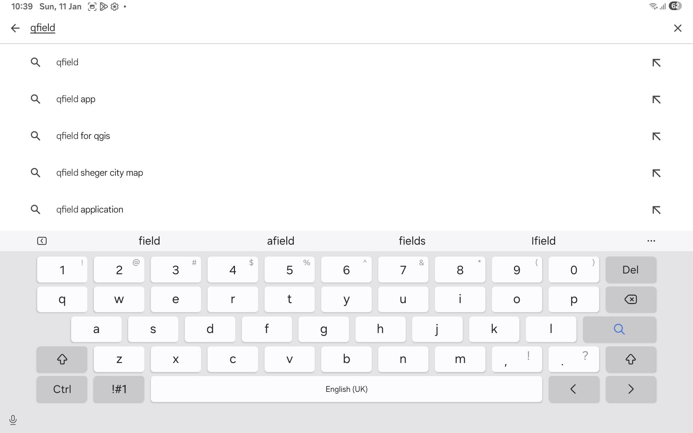

**7.** Click on QField symbol and then *Install* it.
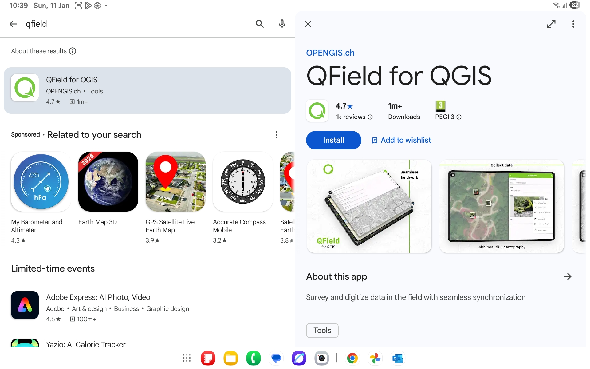

**8.** Once installed, *Open* QField.
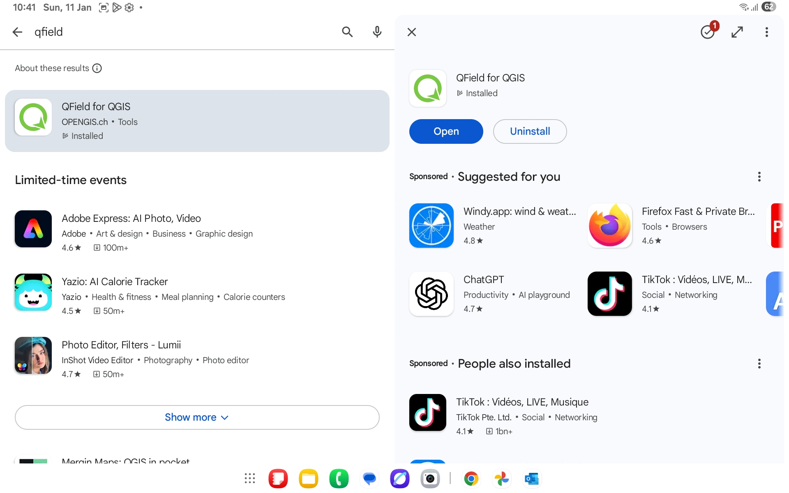

9. Welcome to QField, your computer and tablet configuration is over, we can now start collecting data!
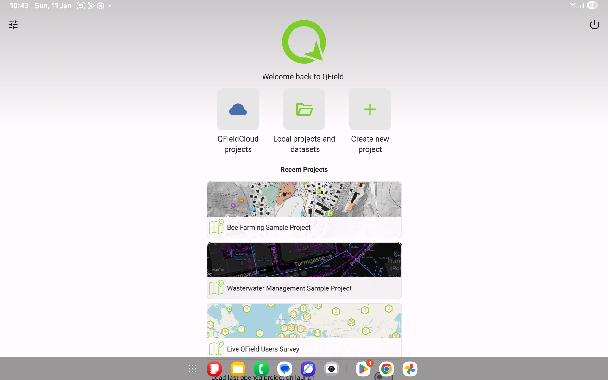

