# (PART) **Data Collection via QGIS** {-}

# Using QField survey
In the last sections, you learnt about [ForestPlots](ForestPlots.net), installed [QGIS](https://qgis.org/) on your computer and [QField](https://qfield.org/) on your field tablet. It is now time to learn how to collect data in the field using QField. 

Your tablets have been pre-loaded with a QField survey so you can have directly have a hands-on experience. Here is you get access to it:

**1.** Go to the application menu and open QField.
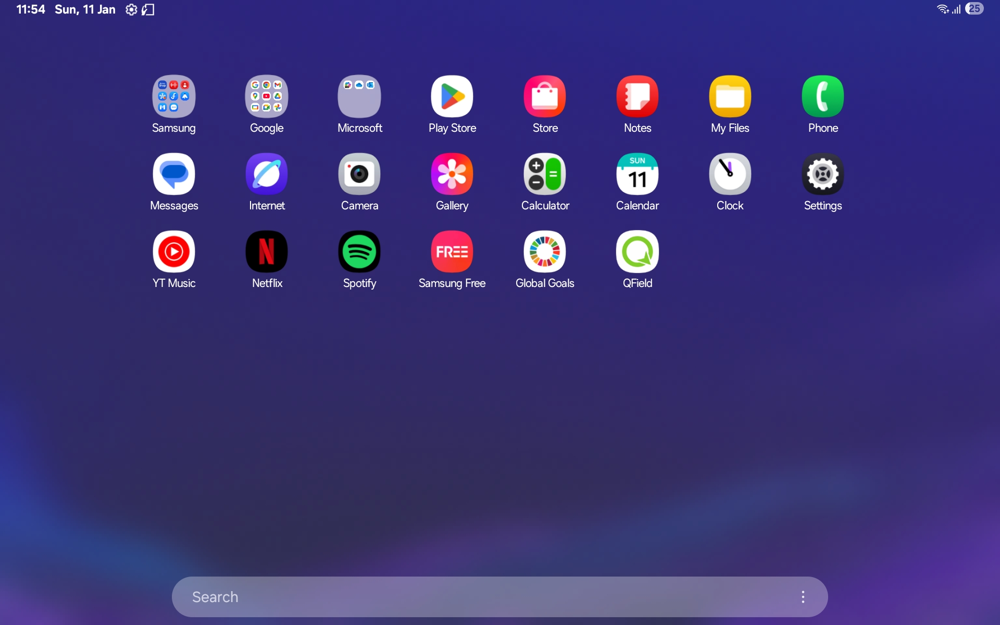

**2.** Click *Local projects and datasets*.
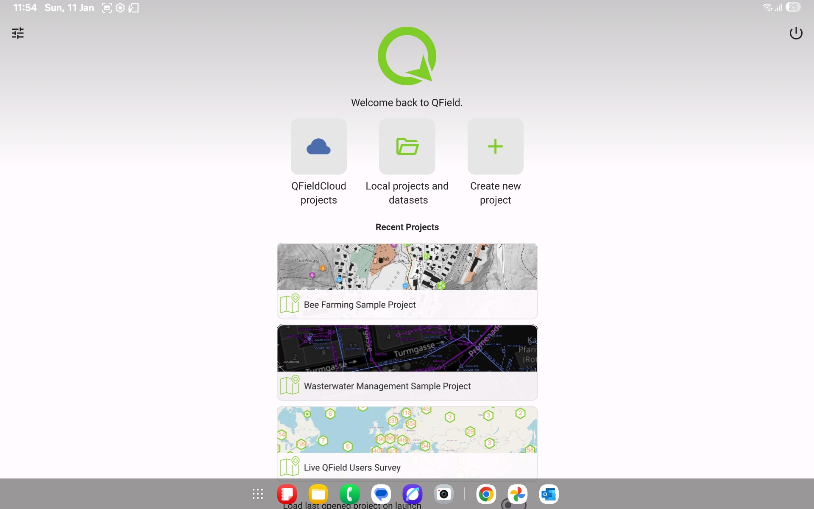

**3.** An access window will pop-up the first time you use QField. Select *Allow all*.
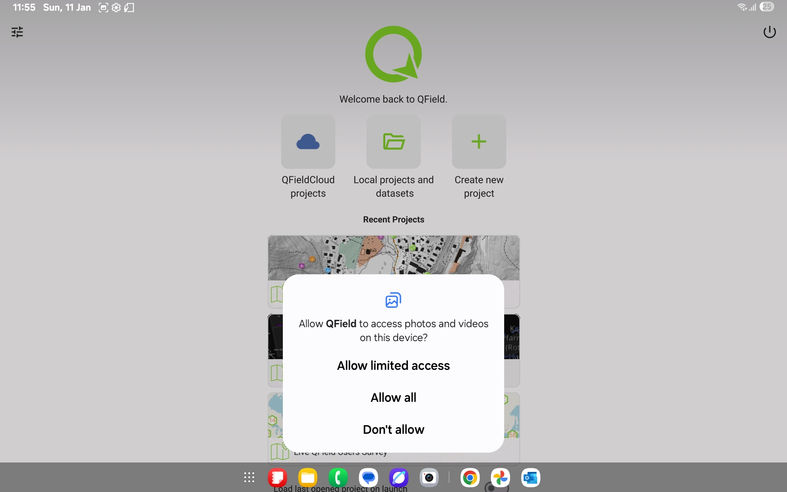

**4.** Click on the green button in the bottom right corner.
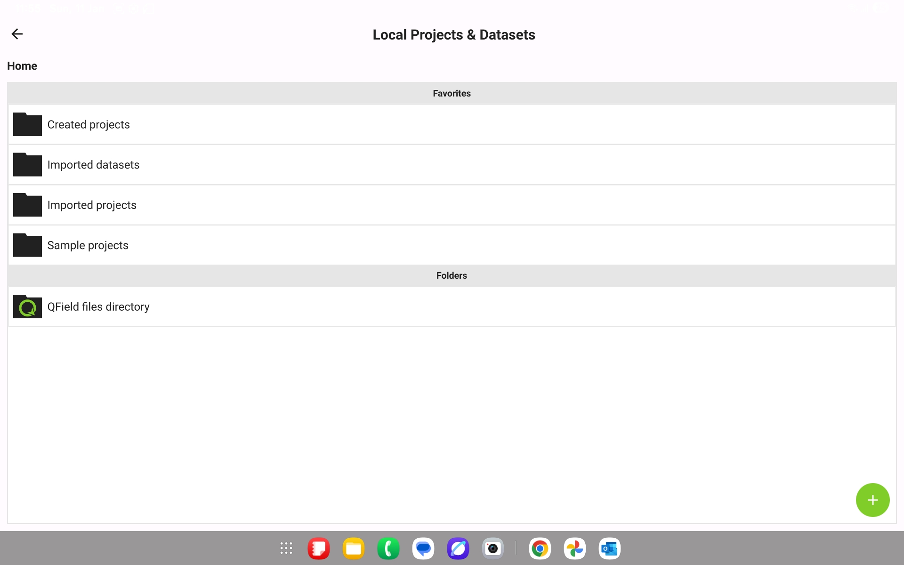

**5.** Click on *Import project from folder* in the pop-up menu.
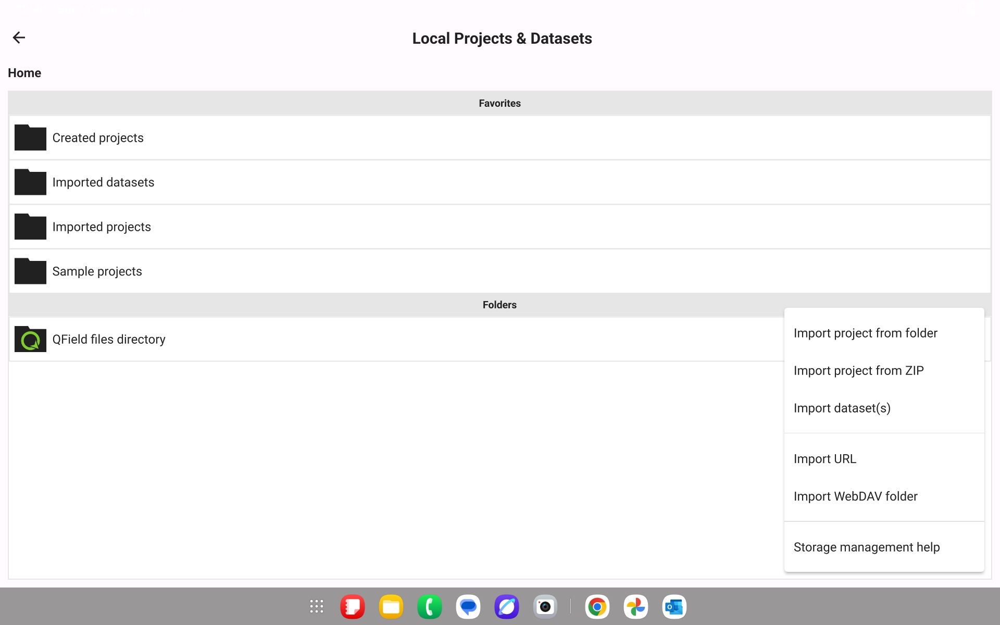

**6.** Click on `qgis_training_example1` folder.
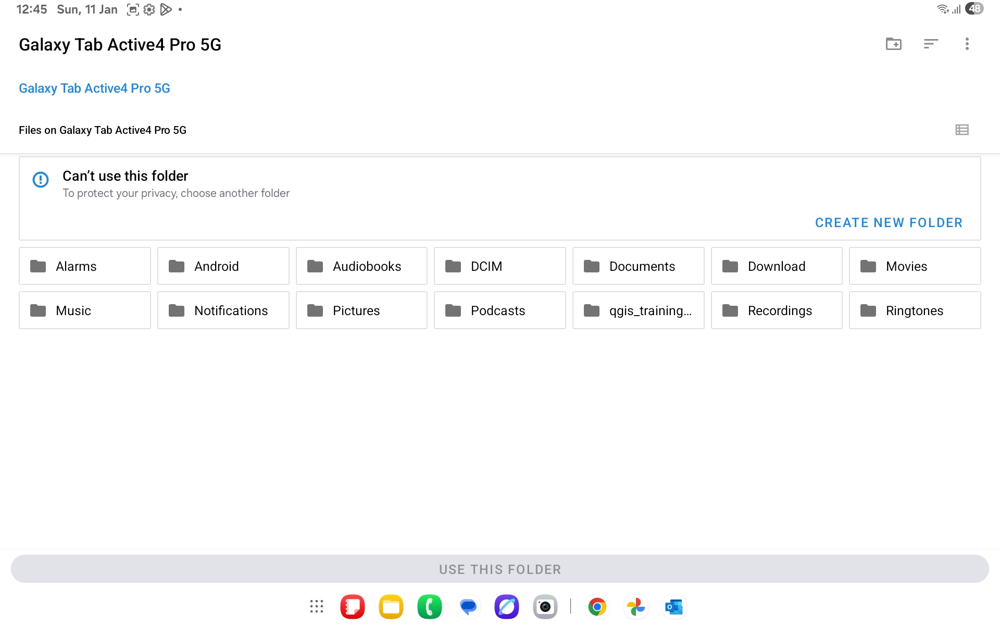

**7.** Click on *Use this folder*.
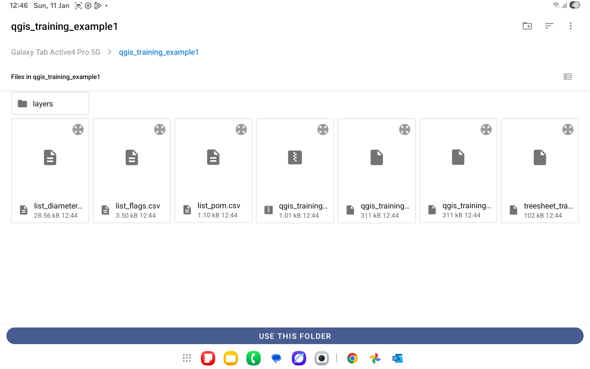

**8.** Click on *Allow* on the pop-up window.
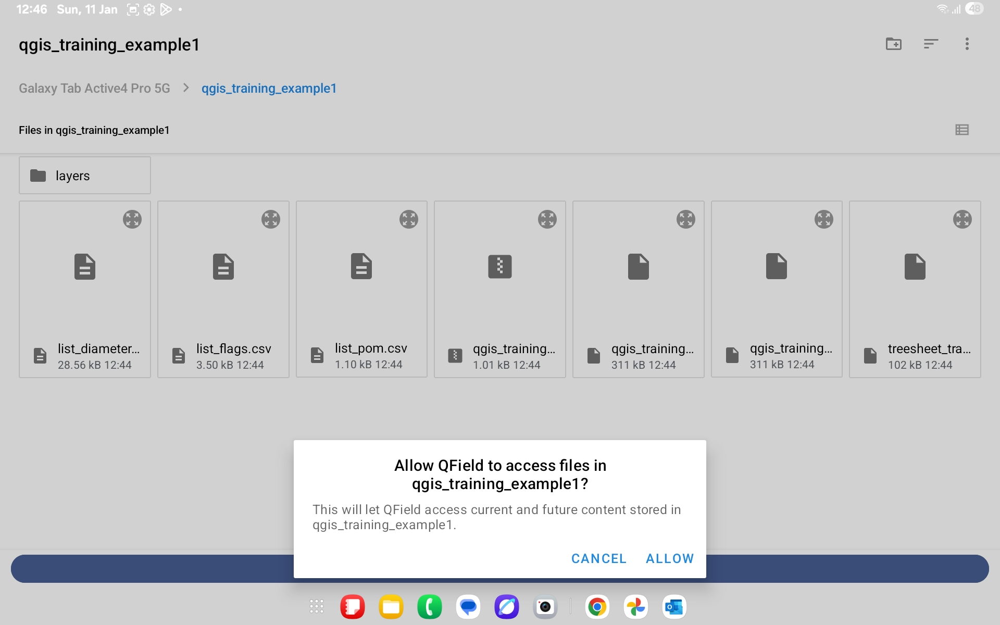

**9.** Click on `qgis_training_example1_qfield`.
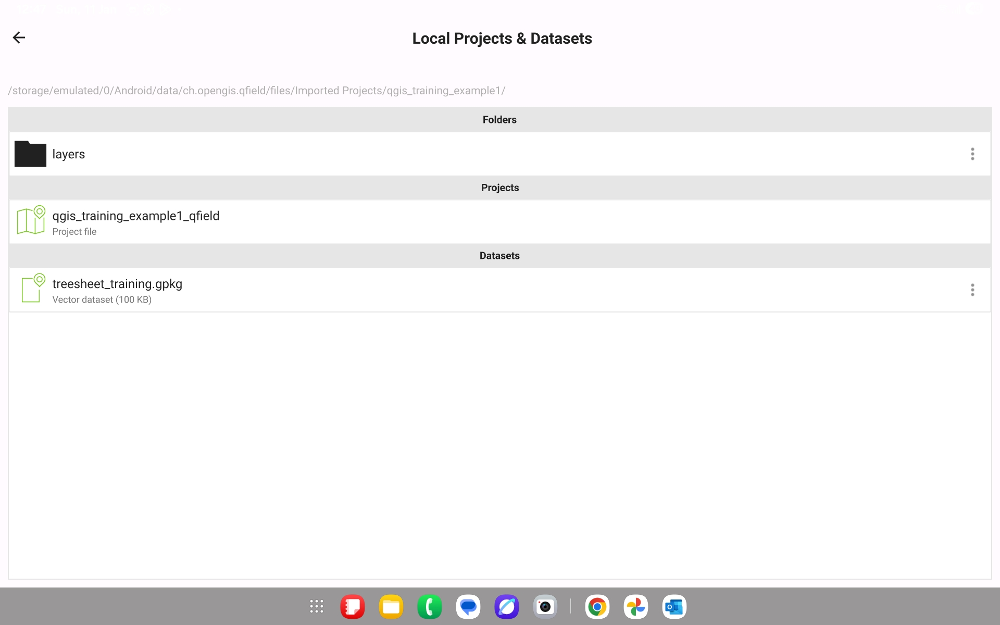

**10.** Here is your plot to inventory, you can click on tree number 1.
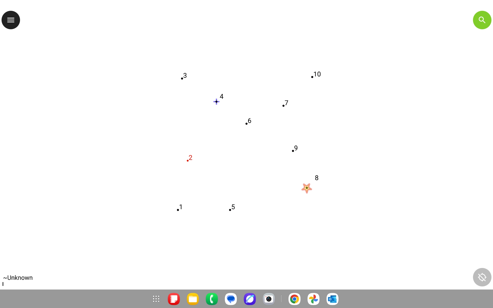

**11.** Click on *1* in the right-hand panel.
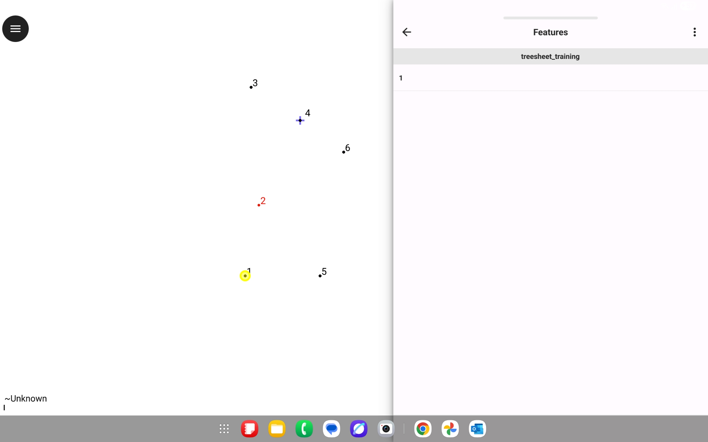

**12.** Click on the pencil symbol in the top-right corner, you can start typing data in!
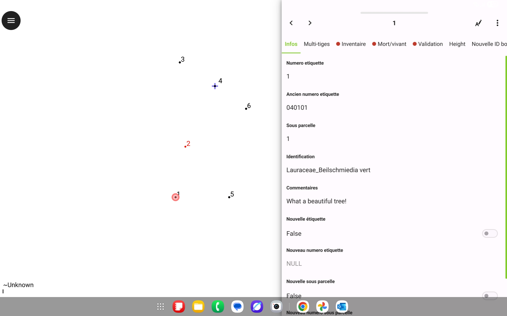
