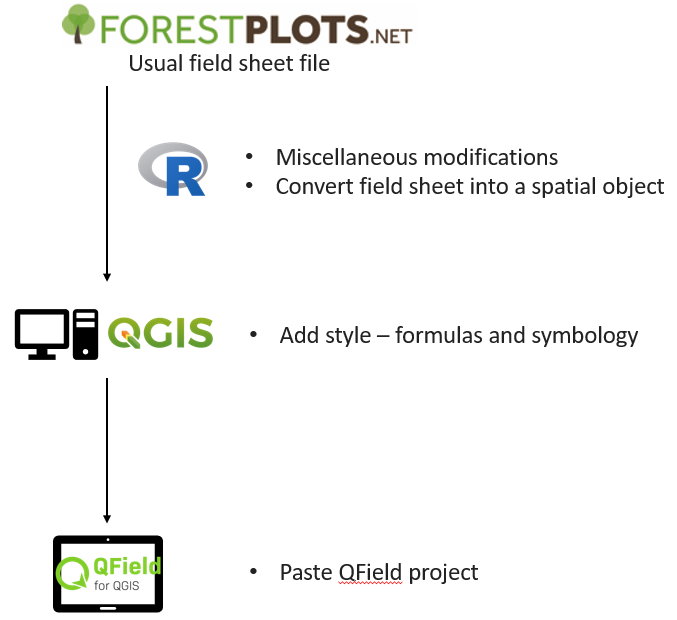

```{r setup, include=FALSE, echo = FALSE}
# Basic knitr options
library(knitr)
opts_chunk$set(comment = NA, 
               echo=FALSE,
               warning = FALSE, 
               message = FALSE, 
               error = TRUE, 
               cache = FALSE,
               fig.width = 9.64,
               fig.height = 5.9,
               fig.path = 'figures/')
options(scipen=999)
```

# Welcome to ForestPlots course on digital data collection!

This course aims at providing principal researchers and field leaders the tools to collect data digitally in the field. It relies on QGIS and QField softwares, respectfully for computers and tablets.

For this course, you will need:  
* a computer running on Windows, ideally Windows 11 (this training is not yet available for Mac users)  
* an Android tablet  
* a cable to link the computer and the tablet (usually USB-A and USB-C, or double USB-C)  
* an internet connection  

*Can everyone please introduce their experience with digital data collection or data collection in general?*


## Advantages and Risks of a Tablet {-}
*Can everyone please share the advantages and risks they could face with digital data collection?*

Advantages | Risks
-----------|------------------
Time saver | Misoneism
Less prone to error | Electronic waste
Workflow more fluid | Cost
More flexible | Data loss (including theft)
Less paper | Difficult access to electricity
Data spatialisation |


## Summary of Digital Data Collection {-}
Now that we are aware of the advantages and risks of digital data collection, we can start the technical training, structured around the main components of digital data collection:


